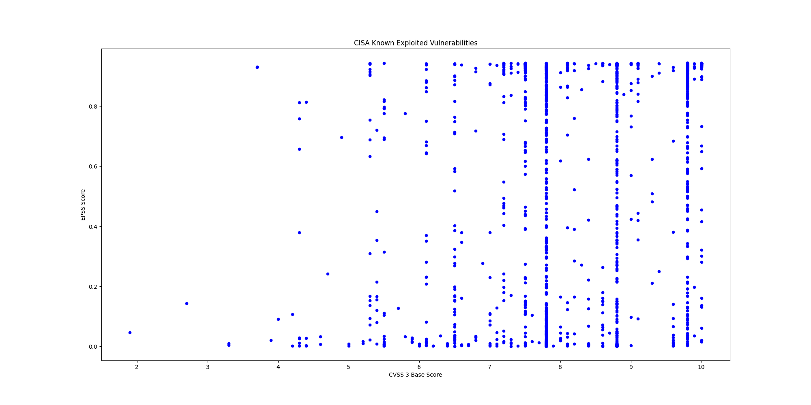

# CISA Known Exploited Vulnerabilities Enrichment

This project comprises a simple jupyter notebook that downloads the [CISA Known Exploited Vulnerabilities](https://www.cisa.gov/known-exploited-vulnerabilities-catalog) and enrichs it with the current [EPSS](https://www.first.org/epss/) and the [CVSS V3 Base Score](https://www.first.org/cvss/).

All the current CISA Known Exploited CVEs with their scores are available in this [CSV file](epss_kev_nvd.csv).

## Current Scatter Plot

## Github Action

This reposiotry is updated automatically every 12 hours with a [Github Action](https://github.com/features/actions).
